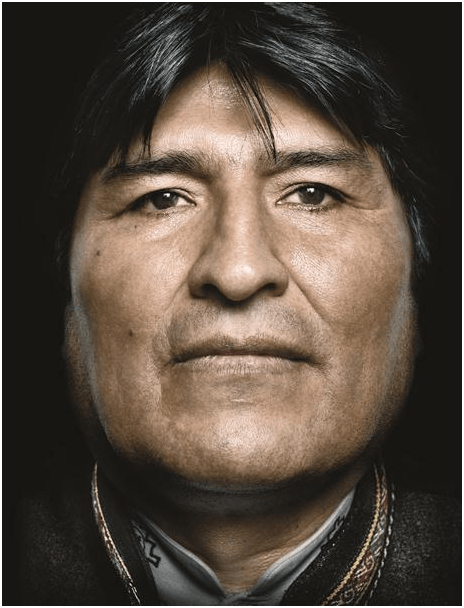
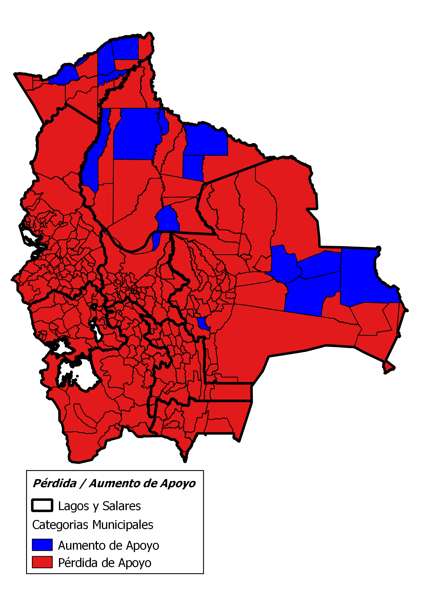
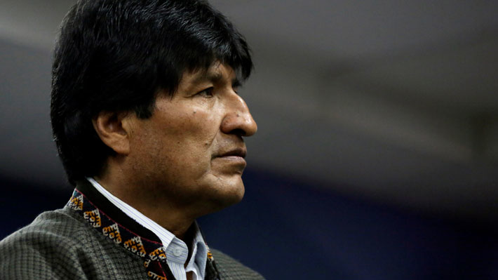
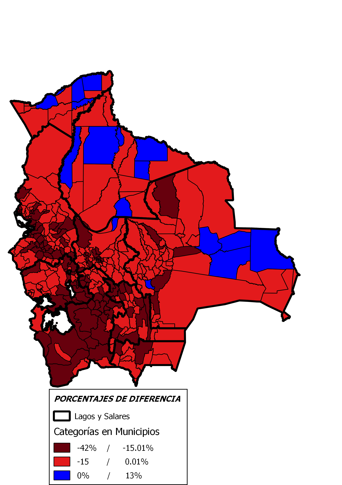
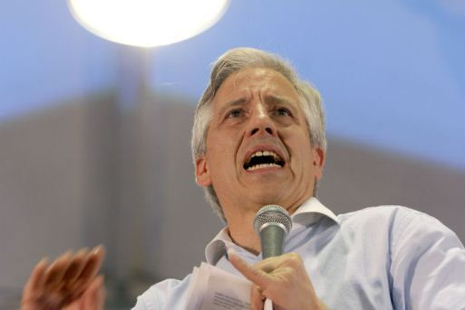
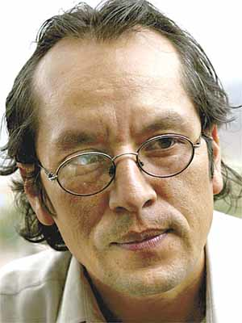

---
output:
    html_document:
        highlight: kate
        theme: journal
        self_contained: false
        fig_caption: true
---

```{r setup, include=FALSE}
knitr::opts_chunk$set(echo = F)
Sys.setlocale(locale = "es_ES.UTF-8")
setwd("/Users/rafalopezv/Dropbox/R/analisis.electoral/21F/")

# Cargado de paquetes necesarios
pkgs <- c("rio", "magrittr", "xlsx", "readxl", "stringi", "gdata",
          "gsubfn", "dplyr", "plyr", "leaflet", "plotly")
lapply(pkgs, function(x) require(x, character.only = TRUE))
rm(pkgs)
```
<br>
<br>
<!-- Header -->
<center><h1><i class="fa fa-thumb-tack"></i>La derrota del 21F: La historia que cuentan los números</h1></center>
<br>
<br>
<center>El 21 de Febrero de 2016, el presidente Evo Morales Aima sufrió su primera derrota electoral.
No es la primera vez que el partido de gobierno pierde una elección, pero es la primera vez que el presidente Morales pierde el apoyo que, incuestionablemente, tuvo desde las elecciones del año 2005</center>
<br>
<center></center>
<br>

A un año del referendo por la reelección...

**¿Qué dicen los números?**

**¿Cómo, dónde y por qué perdió realmente el Presidente Morales?**

<center><h2>**VOTO EN EL EXTERIOR: ¿Bastión del Presidente?**</center></h2>
<br>
<center></center> >*"En el exterior se ha dado un fenómeno muy interesante. En algunos países, en Asia, ganó el No, pero son 10, 20, 40, 100 votos. Sin embargo, en los lugares donde hay mayor presencia boliviana, de gente trabajadora, sencilla y esforzada, como es el caso de Argentina y Brasil, el SI ha ganado de manera abrumadora, con cerca del 80% en Argentina, y 80% en Brasil. Sin embargo, el recuento oficial lo va a dar el TSE. Pero por supuesto que esos datos influyen de manera notable en el recuento final" Alvaro García Linera*
*Fuente:* [La Razón](http://www.la-razon.com/index.php?_url=/nacional/animal_electoral/dice-votos-paises-clave_0_2441155884.html)
<br>
<br>
<center><h4>**Los resultados oficiales del voto en el exterior muestran dos verdades muy claras**:<center></h4>

<center><h4>Casi la mitad de las y los electores **NO FUERON A VOTAR**<center><h4>
```{r pressure, echo=FALSE,include=T}
agregado.3 <- rio::import("bases/agregado.3.csv")
g1 <- plot_ly(agregado.3, x = agregado.3$PROCESO, y = agregado.3$`PORCENTAJE EMITIOS`,
              type = "bar", name = "VOTOS EMITIDOS") %>%
  add_trace(y = agregado.3$`PORCENTAJE ABSTECIÓN`, name = "ABSTENCIÓN") %>%
  layout(barmode = "stack")
g1
```
<br>
<br>
<center><h4>La tendencia de los que votaron el 21F muestra una **PÉRDIDA DE APOYO DEL 21%**<center></h4>
```{r,echo=FALSE,include=T}
perdida.afuera <- rio::import("bases/perdida.afuera.csv")
g2 <- plot_ly(perdida.afuera, x = perdida.afuera$PROCESO, 
              y = perdida.afuera$APOYO, type = "bar", name = "yyy")
g2
```
<br>
<br>
<center><h4>Las y los bolivianos pueden votar en 33 países además de Bolivia. Sin embargo, el 95% de los votos del exterior se concentran en 6 paÍses:<center></h4>
```{r,echo=FALSE,include=T}
caida.emitidos.exterior <- rio::import("bases/caida.emitidos.exterior.csv")
g3 <- plot_ly(caida.emitidos.exterior, 
             labels = caida.emitidos.exterior$PAÍS, 
             values = caida.emitidos.exterior$`DIFERENCIA EMITIDOS EVO POSITIVO` , type = "pie") %>%
  layout(xaxis = list(showgrid = FALSE, zeroline = FALSE, showticklabels = FALSE),
         yaxis = list(showgrid = FALSE, zeroline = FALSE, showticklabels = FALSE))
g3
```
<br>
<br>
<center><h4>En comparación con las elecciones nacionales de 2014, más de 80 mil personas **NO VOTARON POR EVO MORALES**<center></h4>
```{r,echo=FALSE,include=T}
perdida.porcentaje.exterior1 <- rio::import("bases/perdida.porcentaje.exterior1.csv")
g4 <- plot_ly(perdida.porcentaje.exterior1, 
              x = perdida.porcentaje.exterior1$`DIFERENCIA EVO`,
              y = perdida.porcentaje.exterior1$PAÍS,
              type = "bar", name = "xxx", orientation = "h")
g4
```
<br>
<br>
<center><h4>De los que sí votaron, la comparación de ambas elecciones muestra que el presidente PERDI? en 31 de los 33 pa?ses. En promedio, el apoyo al presidente en el exterior **BAJÓ 21%**<center></h4>
```{r,echo=FALSE,include=T}
perdida.porcentaje.exterior2 <- rio::import("bases/perdida.porcentaje.exterior2.csv")
g5 <- plot_ly(perdida.porcentaje.exterior2, 
              x = perdida.porcentaje.exterior2$`PÉRDIDA PORCENTAJES`,
              y = perdida.porcentaje.exterior2$PAÍS,
              type = "bar", name = "xxx", orientation = "h")
g5
```
<br>
<br>
<br>
<center><h2>**EL VOTO en los municipios: las dimensiones de la derrota electoral**<center></h2>
<center></center> >*"Hubo un momento particular, la gente no votó definitivamente en su gran mayoría con su cerebro lo hizo con el hígado o con el páncreas o con otro órgano que no necesariamente es para analizar y reflexionar, es parte de ese resultado" José Alberto (Gringo) Gonzáles*
*Fuente:* [Página Siete](http://www.paginasiete.bo/nacional/2017/2/9/gonzales-la-gente-voto-gran-mayoria-cerebro-sino-higado-126754.html)
<br>
<br>
<br>
<center></center> >*El 21F ha sido un momento de recomposición generado desde Estados Unidos que reorganiza el campo político en Bolivia. Ahora la pregunta es si esta acumulación de fuerza política, de analistas encubiertos, de medios de comunicación, que han permitido el avance de su retaguardia a la primera línea de campaña política va a ser suficiente para dar batalla al proceso de cambio. Juan Ramón Quintana*
*Fuente:* [Telesur](http://www.telesurtv.net/bloggers/Entrevista-a-Juan-Ramon-Quintana-Ministro-de-la-Presidencia-de-Bolivia-20160726-0006.html)
<br>
<br>
<center><h2>**EL VOTO en los municipios: las dimensiones de la derrota electoral**<center></h2>
De 339 municipios, el presidente perdió apoyo en 324. Es decir, que **el NO ganó en el 96% de los municipios del país**
<center></center>
<br>
<br>
<center><h2>¿Cuánto apoyo perdió realmente el Presidente Morales?<center></h2>
<br>
<center></center> >*"Me ha sorprendido que después de semejante campaña el 50% sea el voto duro de nuestra revolución".Evo Morales Aima*
*Fuente:* [La Razón](http://www.la-razon.com/nacional/animal_electoral/Frases-Evo-Morales_0_2442355800.html)
<br>
<br>
<br>
> *"Estoy seguro que por culpa de algunas de nuestras autoridades hemos perdido. Estamos investigando por qué". Evo Morales Aima*
*Fuente:*  [La Razón](http://www.la-razon.com/nacional/animal_electoral/Frases-Evo-Morales_0_2442355800.html)
<br>
<br>
En comparación a las elecciones de 2014, en las que el MAS ganó con cerca del 61% del total de votos a nivel nacional, el presidente Morales en el referendo de 2016 **PERDIÓ CERCA A 630 mil votos, que equivalen a casi el 13%.**
<br>
<br>
<center></center>
<br>
<br>
<center><h2>¿**?Por qué perdió el Presidente Morales?**?<center></h2>
<br>
<center></center> >*"(Sobre Potosí) Sí, eso fue duro, porque hemos bajado a menos del 20%, cuando bordeábamos el 40%, 50%. Pese a todo, hemos podido remontar una pregunta muy complicada".Alvaro García Linera*
*Fuente:* [Eju](http://eju.tv/2016/05/garcia-linera-todos-fuimos-titeres-tres-cuatro-personas/)
<br>
<br>
<br>
<center></center> >*"Ellos piensan que es por Zapata. A nosotros que nos importa eso, no somos tontos, sentimos y pensamos así". Johnny Llally*
*Fuente:* [Eju](http://eju.tv/2017/02/oficialismo-se-autoengana-sobre-causa-de-su-derrota/)
<br>
<br>
<br>
> *"Señor Evo Morales, usted ha enviado a estos dirigentes que eran sus candidatos. Han quitado la vida  de gente inocente. ¿Cuántas vidas más tienen que ofrendarse?...¿Qué hizo El Alto  para merecer esta masacre?". Nancy Conde, ex directora de Desarrollo Humano del Gobierno Municipal de El Alto*
*Fuente:* Página Siete[Página Siete](http://www.paginasiete.bo/especial02/2016/2/18/seis-muertos-asalto-alcaldia-altena-87136.html)  
<br>
<br>
## Los conflictos influyeron de manera importante en la pérdida de apoyo del presidente. 
<br>
## Claramente, el apoyo histórico al presidente Morales ***ha BAJADO*** en lugares estratégicos para el MAS.
<br>
<br>
GRAFICO TENDENCIAS
<br>
<br>
<center></center>

> *"Ustedes saben muy bien que el pasado 21 de febrero ganó la mentira. No sé de dónde viene esa propuesta de pedir la anulación del referendo, pero puedo imaginarme que es suscitado por las mentiras, mentiras y mentiras".Evo Morales Aima*
*Fuente:* [Telesur](http://www.telesurtv.net/news/Evo-Morales-Derrota-en-referendo-fue-por-mentiras-de-la-derecha-20161223-0031.html)

## El presidente necesitaba 69.244 votos más para ganar el 21F.
<br>
## ***El presidente perdió 99.858 votos en Potosí, El Alto y su propio bastión, el Chapare...***
<br>
<br>
<center></center>

> *"El Gobierno se equivoca cuando cree que son solamente los asuntos personales (de Morales) los que los llevaron a perder la elección, la campañaa del MAS está viciada por la soberbia y la intemperancia de tipos como García Linera y Hugo Moldiz".Walter Chávez*
*Fuente:* [Eju](http://eju.tv/2016/03/walter-chavez-atribuye-la-derrota-del-al-vicepresidente-hugo-moldiz/)


