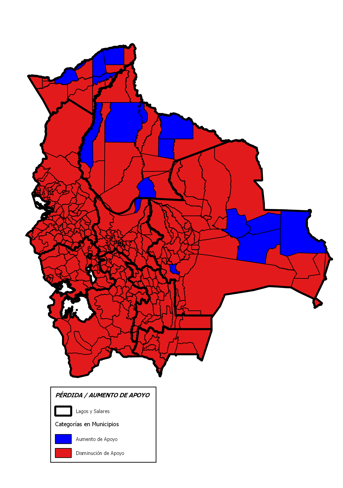

---
output:
    html_document:
        highlight: kate
        theme: journal
        self_contained: false
        fig_caption: true
---

```{r setup, include=FALSE}
knitr::opts_chunk$set(echo = F)
Sys.setlocale(locale = "es_ES.UTF-8")
setwd("/Users/rafalopezv/Dropbox/R/analisis.electoral/21F/")

# Cargado de paquetes necesarios
pkgs <- c("rio", "magrittr", "xlsx", "readxl", "stringi", "gdata",
          "gsubfn", "dplyr", "plyr", "leaflet", "plotly")
lapply(pkgs, function(x) require(x, character.only = TRUE))
rm(pkgs)
```
<!-- Header -->
<center><h1><i class="fa fa-thumb-tack"></i>21F: La historia que cuentan los números</h1></center>
<br>
El 21 de Febrero de 2016 el electorado boliviano optó por rechazar la propuesta de reforma constitucional que permitiría la repostulación del Presidente Morales en el año 2019.  
<br>
<center></center>
<center></center>
<br>
No es la primera vez que el MAS pierde una elección, pero es la primera vez que el apoyo político al Presidente Morales disminuye respecto a procesos electorales pasados
<br>
<br>
El análisis compara las elecciones nacionales de 2009 y 2014 con los resultados del referendo del 21 de febrero de 2016. En los 3 procesos electorales considerados, la figura del presidente Morales es, políticamente, la que está en juego.
<br>
<br>
Los resultados muestran que:

- El apoyo político al Presidente Morales ha disminuido

- Hay varios factores que jugaron un rol para que la opción del NO gane, entre los cuales se destacan una significativa disminución de votantes en el exterior, un impacto negativo de conflictos sociales en lugares estratégicos y, finalmente, una tendencia general de disminución del apoyo al Presidente Morales.
<br>
<br>
<center><h2>**VOTO EN EL EXTERIOR: ¿Bastión del Presidente?**</center></h2>
<br>
<center><h3>Los resultados oficiales del voto en el exterior muestran DOS VERDADES:<center></h3>
<br>
<br>
<center><h4> Sólo 1 de cada 3 electores fue a votar<center></h4>
<center><h4> El apoyo al Presidente en el exterior ha dismimuído en 21%<center></h4>
<br>
<br>
Los bolivianos en el exterior votan en 33 países; sin embargo, el 95% de los votantes se concentran en Argentina, Brasil, España, Estados Unidos, Italia y Chile
<br>
<br>
<center><h4> Los que no votaron <center></h4>
<br>
Alrededor de 80 mil personas inscritas no emitieron su voto en el exterior
<br>
<br>
<br>
<center><h4> Argentina, Brasil, España, Estados Unidos, Italia y Chile:  98% de la abstención <center></h4>
```{r,echo=FALSE,include=T}
caida.emitidos.exterior <- rio::import("bases/caida.emitidos.exterior.csv")
g3 <- plot_ly(caida.emitidos.exterior, 
             labels = caida.emitidos.exterior$PAÍS, 
             values = caida.emitidos.exterior$`DIFERENCIA EMITIDOS EVO POSITIVO` , type = "pie") %>%
  layout(xaxis = list(showgrid = FALSE, zeroline = FALSE, showticklabels = FALSE),
         yaxis = list(showgrid = FALSE, zeroline = FALSE, showticklabels = FALSE))
g3
```
<br>
<br>
<center><h4> A nivel agregado 1 de cada 3 bolivianos en el exterior FUE A VOTAR<center><h4>
```{r pressure, echo=FALSE,include=T}
agregado.3 <- rio::import("bases/agregado.3.csv")
g1 <- plot_ly(agregado.3, x = agregado.3$PROCESO, y = agregado.3$`PORCENTAJE EMITIOS`,
              type = "bar", name = "VOTOS EMITIDOS") %>%
  add_trace(y = agregado.3$`PORCENTAJE ABSTECIÓN`, name = "ABSTENCIÓN") %>%
  layout(barmode = "stack")
g1
```
<br>
<br>
<br>
<center><h4>Los que si votaron<center></h4>
<br>
<br>
<br>
<center><h4>Con respecto a la votación del 2014, el apoyo al Presidente en el exterior muestra una disminución del 21%<center></h4>
<br>
```{r,echo=FALSE,include=T}
perdida.afuera <- rio::import("bases/perdida.afuera.csv")
g2 <- plot_ly(perdida.afuera, x = perdida.afuera$PROCESO, 
              y = perdida.afuera$APOYO, type = "bar", name = "yyy")
g2
```
<br>
<br>
<center><h4> Porcentualmente, El Presidente PERDIÓ apoyo en 31 de 33 países respecto a la elección general de 2014. Sólo incrementó votación en la INDIA, donde votaron 9 personas 
<br>
<br>
```{r,echo=FALSE,include=T}
perdida.porcentaje.exterior2 <- rio::import("bases/perdida.porcentaje.exterior2.csv")
g5 <- plot_ly(perdida.porcentaje.exterior2, 
              x = perdida.porcentaje.exterior2$`PÉRDIDA PORCENTAJES`,
              y = perdida.porcentaje.exterior2$PAÍS,
              type = "bar", name = "xxx", orientation = "h")
g5
```
<br>
<br>
<center><h4>Disminución de votos absolutos en los principales países de votación en el exterior respecto a la elección general de 2014<center></h4>
<br>
```{r,echo=FALSE,include=T}
perdida.porcentaje.exterior1 <- rio::import("bases/perdida.porcentaje.exterior1.csv")
g4 <- plot_ly(perdida.porcentaje.exterior1, 
              x = perdida.porcentaje.exterior1$`DIFERENCIA EVO`,
              y = perdida.porcentaje.exterior1$PAÍS,
              type = "bar", name = "xxx", orientation = "h")
g4
```
<br>
<br>
<br>
<center><h2>**VOTO EN BOLIVIA**<center></h2>
<br>
<br>
<center><h4>De 339 municipios, el Presidente REDUJO SU APOYO en 324 (96%), respecto a la elección general de 2014<center>
<br>
<center></center>
<br>
<br>
En comparación a las elecciones de 2014, en las que el MAS ganó con cerca del 61% del total de votos a nivel nacional, el Presidente Morales en el referendo de 2016 PERDIÓ CERCA A 630 mil votos, que equivalen a casi el 13%.
<br>
<br>
El gráfico siguiente muestra la intensidad de la disminución o incremento del apoyo a Evo Morales en porcentajes
<br>
<br>
<center></center>
<br>
<br>
<br>
<center><h4>Los conflictos influyeron de manera importante en la pérdida de apoyo del presidente en Bolivia<center></h4> 
<br>
<br>
El apoyo histórico al presidente Morales ha disminuído en lugares estratégicos
<br>
<br>
<br>
```{r,echo=FALSE,include=T}
clave3 <- rio::import("bases/clave3.csv")
g7 <- plot_ly(clave3, x = clave3$PROCESO, y = clave3$CHAPARE, type = "scatter", mode = "lines", name = "CHAPARE") %>%
  add_trace(y = clave3$`EL ALTO`, name = "EL ALTO") %>% add_trace(y = clave3$POTOSÍ, name = "POTOSÍ")
g7
```
<br>
<br>
<br>
<center><h2>El presidente necesitaba 69.244 votos más para ganar el 21F<center></h2>
<br>
<br>
<center><h2>El presidente perdió 99.858 votos en Potosí, El Alto y su propio bastión, el Chapare<center></h2>
<br>
<br>
<br>
##CONCLUSIONES
<br>
<br>
- Un factor que ha afectado el resultado del referendo del 21 de febrero de 2016 es que cerca a 80 mil personas inscritas en el padrón en el exterior NO votaron, lo que podría entenderse como un síntoma de apatía o desinterés. Considerando que la tendencia del voto en el exterior es de mayoritario apoyo al presidente, la abstención ha jugado un rol en contra de la propuesta.
<br>
<br>
- Aunque el voto en el exterior aún muestra una tendencia favorable al Presidente Morales, hay una disminución significativa de un 21% a nivel agregado. La tendencia negativa es evidente incluso en los recintos que antes fueran más fuertes como Brasil y Argentina.
<br>
<br>
- En territorio boliviano, con respecto a 2014, hay una pérdida de apoyo al Presidente en el 96% de los municipios. En términos de votos, eso se traduce en cerca a 630 mil personas MENOS. 
<br>
<br>
- Si se contrastan espacios estratégicos con conflictos sociales mayores en los meses previos al referendo, puede evidenciarse una correlación entre los conflictos y una pérdida más intensa de apoyo, como muestra el caso de Potosí y El Alto.
<br>
<br>
- En términos generales, el apoyo al presidente ha disminuido, no por causa de un solo y único conflicto o temática, sino por una serie de hechos, factores y conflictos.

##REFERENCIAS
<br>
<br>
Declaraciones de autoridades del gobierno nacional
<br>
Evo Morales
<br>
[Las frases con las que Evo Morales evaluó los resultados del referéndum](http://www.la-razon.com/nacional/animal_electoral/Frases-Evo-Morales_0_2442355800.html)
<br>
Álvaro García Linera
<br>
[MAS dice que el Sí tiene 80% de votos en 2 países clave]( http://www.la-razon.com/index.php?_url=/nacional/animal_electoral/dice-votos-paises-clave_0_2441155884.html)
[García Linera: “Todos fuimos títeres de tres o cuatro personas”]( http://eju.tv/2016/05/garcia-linera-todos-fuimos-titeres-tres-cuatro-personas/)
<br>
Juan Ramón Quintana
<br>
[“En Bolivia existen dos opciones: la restauración conservadora, o la profundización del proceso de cambio”](http://www.telesurtv.net/bloggers/Entrevista-a-Juan-Ramon-Quintana-Ministro-de-la-Presidencia-de-Bolivia-20160726-0006.html)
<br>
Reymi Ferreira
<br>
[Ferreira: El 21 de febrero hay que rechazar el "carnaval de la mentira"](http://www.paginasiete.bo/nacional/2017/2/5/ferreira-febrero-rechazar-carnaval-mentira-126247.html)
<br>
José Alberto Gonzales 
[Gonzales: "la gente no votó en su gran mayoría con el cerebro sino con el hígado"](http://www.paginasiete.bo/nacional/2017/2/5/ferreira-febrero-rechazar-carnaval-mentira-126247.html)
<br>
Declaraciones de medios y otras personalidades sobre el 21F
<br>
Walter Chávez
[Walter Chávez atribuye la derrota del Sí al Vicepresidente y Hugo Moldiz](http://eju.tv/2016/03/walter-chavez-atribuye-la-derrota-del-al-vicepresidente-hugo-moldiz/)
<br>
Boris Miranda
<br>
[Cómo se explica y qué significa para Bolivia la derrota de Evo Morales en el referendo por su cuarto mandato](http://www.bbc.com/mundo/noticias/2016/02/160222_significado_derrota_evo_morales_referendo_reeleccion_bolivia_bm)
<br>
Pablo Stefanoni
[Un referéndum por penales]( http://www.rebelion.org/noticia.php?id=209245)
<br>
BBC Noticias
[Q&A: Bolivia referendum]( http://www.bbc.com/news/world-latin-america-35617059)
<br>
Sobre el conflicto con Potosí
<br>
Johnny Llally
[Oficialismo se autoengaña sobre causa de su derrota]( http://eju.tv/2017/02/oficialismo-se-autoengana-sobre-causa-de-su-derrota/)
<br>
Sobre el conflicto en El Alto
Nancy Conde, ex Directora Municipal de Desarrollo Humano 
<br>
[Seis muertos en asalto a la Alcaldía alteña](http://www.paginasiete.bo/especial02/2016/2/18/seis-muertos-asalto-alcaldia-altena-87136.html)


