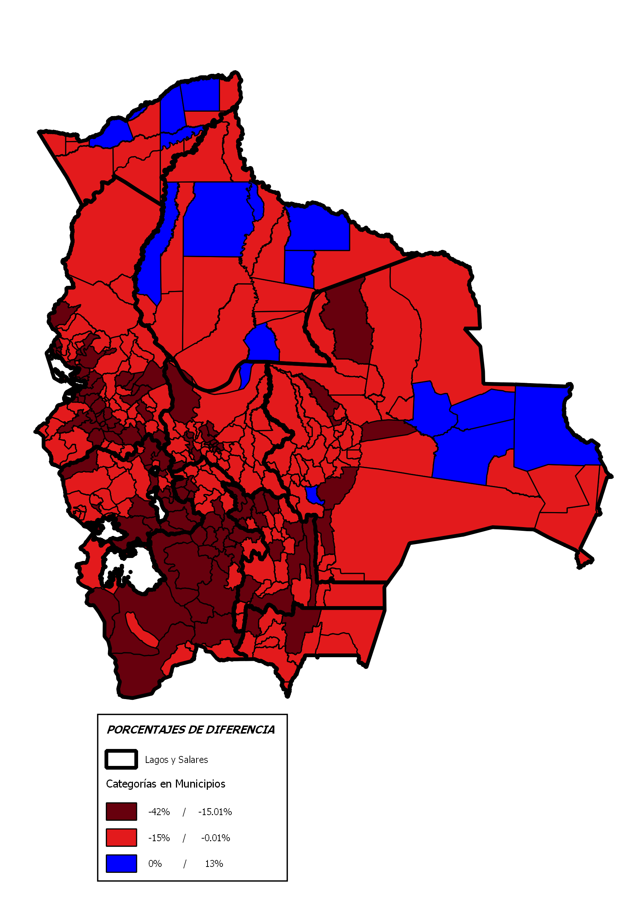

---
output:
    html_document:
        highlight: kate
        theme: journal
        self_contained: false
        fig_caption: true
---

```{r setup, include=FALSE}
knitr::opts_chunk$set(echo = F)
Sys.setlocale(locale = "es_ES.UTF-8")
setwd("/Users/rafalopezv/Dropbox/R/analisis.electoral/21F/")

# Cargado de paquetes necesarios
pkgs <- c("rio", "magrittr", "xlsx", "readxl", "stringi", "gdata",
          "gsubfn", "dplyr", "plyr", "leaflet", "plotly")
lapply(pkgs, function(x) require(x, character.only = TRUE))
rm(pkgs)
```
<!-- Header -->
<center><h1><i class="fa fa-thumb-tack"></i>21F: La historia que cuentan los números</h1></center>
<br>
El 21 de Febrero de 2016 el electorado boliviano optó por rechazar la propuesta de reforma constitucional que permitiría la repostulación del Presidente Morales en el año 2019.  
<br>
<center></center>
<center></center>
<br>
No es la primera vez que el MAS pierde una elección, pero es la primera vez que el apoyo político al Presidente Morales disminuye respecto a procesos electorales pasados
<br>
<br>
El análisis compara las elecciones nacionales de 2009 y 2014 con los resultados del referendo del 21 de febrero de 2016. En los 3 procesos electorales considerados, la figura del presidente Morales es, políticamente, la que está en juego,para ser elegido como presidente o para abrir la posibilidad de que lo continúe siendo. 
<br>
<br>
Los resultados muestran que:

- El apoyo político entendido como votación principalmente enfocada al Presidente Morales ha disminuido

- Hay varios factores que jugaron un rol para que la opción del NO gane, entre los cuales se destacan una significativa disminución de votantes en el exterior, un impacto negativo de conflictos sociales en lugares estratégicos y, finalmente, una tendencia general de disminución del apoyo al Presidente Morales.
<br>
<br>
<center><h2>**VOTO EN EL EXTERIOR: ¿Bastión del Presidente?**</center></h2>
<br>
<center><h3>Los resultados oficiales del voto en el exterior muestran DOS VERDADES:<center></h3>
<br>
<br>
<center><h4> 2 de cada 3 electores no fueron a votar:<center></h4>
<center><h4> El 98% de la abstención se concentra 6 de 33 países:<center></h4>
<br>
<br>
Los bolivianos en el exterior votan en 33 países, sin embargo el 95% de los habilitados para hacerlo se concentran en Argentina, Brasil, España, Estados Unidos, Italia y Chile
<br>
<br>
En consecuencia, quienes no fueron a votar se concentran en los mismos países
<br>
<br>
<br>
<br>
<br>
<center><h4> Argentina, Brasil, España, Estados Unidos, Italia y Chile:  98% del total de la abstención <center></h4>
```{r,echo=FALSE,include=T}
caida.emitidos.exterior <- rio::import("bases/caida.emitidos.exterior.csv")
g3 <- plot_ly(caida.emitidos.exterior, 
             labels = caida.emitidos.exterior$PAÍS, 
             values = caida.emitidos.exterior$`DIFERENCIA EMITIDOS EVO POSITIVO` , type = "pie") %>%
  layout(xaxis = list(showgrid = FALSE, zeroline = FALSE, showticklabels = FALSE),
         yaxis = list(showgrid = FALSE, zeroline = FALSE, showticklabels = FALSE))
g3
```
<br>
<br>
<center><h4> A nivel agregado 2 de cada 3 bolivianos en el exterior NO FUERON A VOTAR<center><h4>
```{r pressure, echo=FALSE,include=T}
agregado.3 <- rio::import("bases/agregado.3.csv")
g1 <- plot_ly(agregado.3, x = agregado.3$PROCESO, y = agregado.3$`PORCENTAJE EMITIOS`,
              type = "bar", name = "VOTOS EMITIDOS") %>%
  add_trace(y = agregado.3$`PORCENTAJE ABSTECIÓN`, name = "ABSTENCIÓN") %>%
  layout(barmode = "stack")
g1
```
<br>
<br>
<br>
Quienes si fueron a votar en el exterior redujeron el apoyo a Evo Morales en 21%
<br>
<br>
<br>
<center><h4>DISMINUCIÓN DE APOYO A EVO MORALES EN EL EXTRIOR EN UN 21%, RESPECTO A LA ELECCIÓN GENERAL 2014<center></h4>
```{r,echo=FALSE,include=T}
perdida.afuera <- rio::import("bases/perdida.afuera.csv")
g2 <- plot_ly(perdida.afuera, x = perdida.afuera$PROCESO, 
              y = perdida.afuera$APOYO, type = "bar", name = "yyy")
g2
```
<br>
<br>
<center><h4> Porcentualmente, El Presidente PERDIÓ apoyo en 31 de 33 países respecto a la elección general 2014.Sólo mejoró en la INDIA, dónde votaron 9 personas 
<br>
<br>
```{r,echo=FALSE,include=T}
perdida.porcentaje.exterior2 <- rio::import("bases/perdida.porcentaje.exterior2.csv")
g5 <- plot_ly(perdida.porcentaje.exterior2, 
              x = perdida.porcentaje.exterior2$`PÉRDIDA PORCENTAJES`,
              y = perdida.porcentaje.exterior2$PAÍS,
              type = "bar", name = "xxx", orientation = "h")
g5
```
<br>
<br>
<center><h4>En votos absolutos, alrededor de 80 mil personas **NO VOTARON POR EVO MORALES respecto a la elección general de 2014**<center></h4>
```{r,echo=FALSE,include=T}
perdida.porcentaje.exterior1 <- rio::import("bases/perdida.porcentaje.exterior1.csv")
g4 <- plot_ly(perdida.porcentaje.exterior1, 
              x = perdida.porcentaje.exterior1$`DIFERENCIA EVO`,
              y = perdida.porcentaje.exterior1$PAÍS,
              type = "bar", name = "xxx", orientation = "h")
g4
```
<br>
<br>
<br>
<center><h2>**VOTO EN BOLIVIA**<center></h2>
<br>
<br>
<center><h4>De 339 municipios, el Presidente REDUJO SU APOYO en 324 (96%), respecto a la elección general de 2014**<center>
<br>
<center></center>
<br>
<br>
En comparación a las elecciones de 2014, en las que el MAS ganó con cerca del 61% del total de votos a nivel nacional, el Presidente Morales en el referendo de 2016 **PERDIÓ CERCA A 630 mil votos, que equivalen a casi el 13%.**. El gráfico siguiente muestra la intensidad del apoyo a Evo Morales en porcentajes
<br>
<center></center>
<br>
<br>
<br>
Los conflictos influyeron de manera importante en la pérdida de apoyo del presidente en Bolivia. 
<br>
## Claramente, el apoyo histórico al presidente Morales ***ha BAJADO*** en lugares estratégicos para el MAS.
<br>
<br>

<br>
<br>

## El presidente necesitaba 69.244 votos más para ganar el 21F.
<br>
## ***El presidente perdió 99.858 votos en Potosí, El Alto y su propio bastión, el Chapare...***
<br>
<br>
<center></center>


